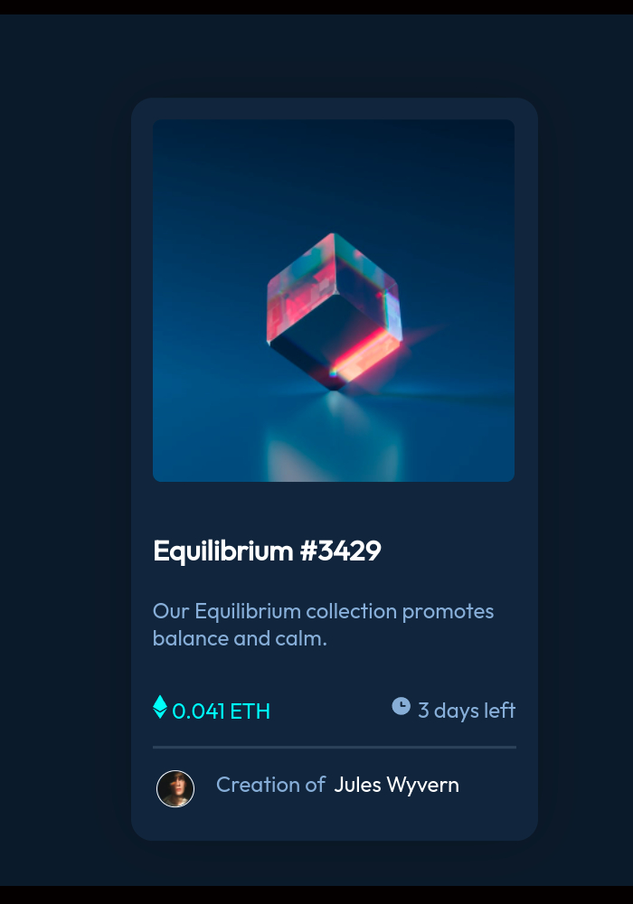

# Frontend Mentor - NFT preview card component solution

This is a solution to the [NFT preview card component challenge on Frontend Mentor](https://www.frontendmentor.io/challenges/nft-preview-card-component-SbdUL_w0U). Frontend Mentor challenges help you improve your coding skills by building realistic projects. 

## Table of contents

- [Overview](#overview)
  - [The challenge](#the-challenge)
  - [Screenshot](#screenshot)
  - [Links](#links)
- [My process](#my-process)
  - [Built with](#built-with)
  - [What I learned](#what-i-learned)
  - [Continued development](#continued-development)
  - [Useful resources](#useful-resources)


## Overview
I chose this specific challenge as I wanted to understand responsive design after completing a course with css. Below is a screenshot that illustrates what I have created with content to use along with a reference to what the end product should resemble.

### The challenge

Users should be able to:

- View the optimal layout depending on their device's screen size
- See hover states for interactive elements

### Screenshot




### Links

- Solution URL: [View GitHub repo](https://github.com/perminder-developyn/NFTcard)
- Live Site URL: [Site](https://perminder-developyn.github.io/NFTcard/)

## My process

### Built with

- Semantic HTML5 markup
- CSS custom properties
- Flexbox
- CSS Grid
- Mobile-first workflow


### What I learned

In this project I have learned about overlaying layered images and making them respond to user interaction (in this case, hovering the mouse)

```html
<div class="image-container">
  
  
 </div>
```
```css
.main-image{
    border-radius: 1.4rem;
    max-width: 89%;
    padding: 1rem;
    display: block;
}

.view{
    border-radius: 0.5rem;
    padding: 6.9rem;
  opacity: 0;
  position: absolute;
  left: 50%;
  transform: translate(-50%, -17.8rem);
}

.image-container:hover{
    cursor: pointer;
}
.image-container:hover .view{
    opacity: 1;
    background-color: rgba(0, 255, 255, 0.518);
}

.image-container:hover .view{
    opacity: 1;
}
```


### Continued development

I want to continue to learn about responsive design as it impacts the user demographic.

### Useful resources

- [media query](https://www.w3schools.com/cssref/css3_pr_mediaquery.asp) - This helped me for understanding how to make changes regarding the screen size.
